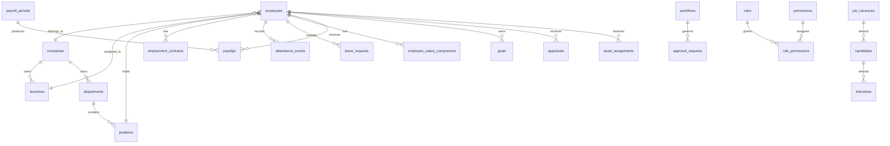

# Database ERD

## Initial Domain ERD

```mermaid
erDiagram
    companies ||--o{ branches : owns
    companies ||--o{ departments : owns
    departments ||--o{ positions : contains
    employees }o--|| companies : belongs_to
    employees }o--|| branches : assigned_to
    employees }o--|| positions : holds
    employees ||--o{ employment_contracts : has
    employees ||--o{ attendance_events : records
    employees ||--o{ leave_requests : submits
    employees ||--o{ employee_salary_components : has
    payroll_periods ||--o{ payslips : produces
    employees ||--o{ payslips : receives
    job_vacancies ||--o{ candidates : attracts
    candidates ||--o{ interviews : attends
    employees ||--o{ goals : owns
    employees ||--o{ appraisals : receives
    employees ||--o{ asset_assignments : receives
    workflows ||--o{ approval_requests : governs
    roles ||--o{ role_permissions : grants
    permissions ||--o{ role_permissions : assigned
```

## Rule

Each feature must replace or extend this high-level ERD with detailed entity relationships before implementation.
