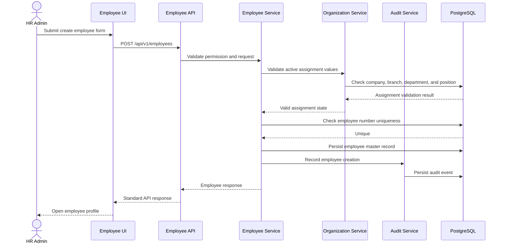

# Employee Sequence Diagram

```mermaid
sequenceDiagram
    actor HR as HR Admin
    participant UI as Employee UI
    participant API as Employee API
    participant Service as Employee Service
    participant Org as Organization Service
    participant Audit as Audit Service
    participant DB as PostgreSQL

    HR->>UI: Submit create employee form
    UI->>API: POST /api/v1/employees
    API->>Service: Validate permission and request
    Service->>Org: Validate active assignment values
    Org->>DB: Check company, branch, department, and position
    DB-->>Org: Assignment validation result
    Org-->>Service: Valid assignment state
    Service->>DB: Check employee number uniqueness
    DB-->>Service: Unique
    Service->>DB: Persist employee master record
    Service->>Audit: Record employee creation
    Audit->>DB: Persist audit event
    Service-->>API: Employee response
    API-->>UI: Standard API response
    UI-->>HR: Open employee profile
```
