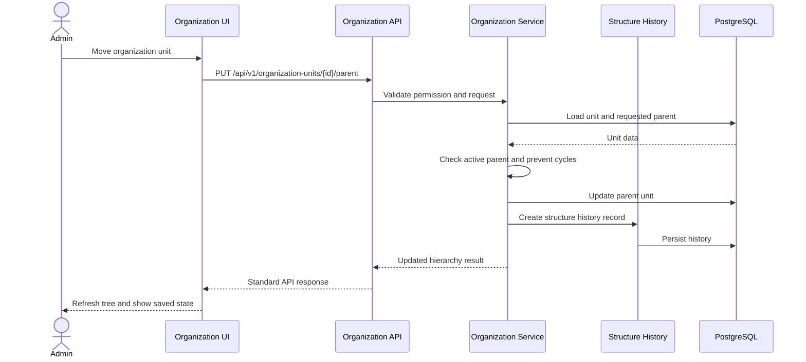

# Organization Sequence Diagram

```mermaid
sequenceDiagram
    actor Admin
    participant UI as Organization UI
    participant API as Organization API
    participant Service as Organization Service
    participant History as Structure History
    participant DB as PostgreSQL

    Admin->>UI: Move organization unit
    UI->>API: PUT /api/v1/organization-units/{id}/parent
    API->>Service: Validate permission and request
    Service->>DB: Load unit and requested parent
    DB-->>Service: Unit data
    Service->>Service: Check active parent and prevent cycles
    Service->>DB: Update parent unit
    Service->>History: Create structure history record
    History->>DB: Persist history
    Service-->>API: Updated hierarchy result
    API-->>UI: Standard API response
    UI-->>Admin: Refresh tree and show saved state
```
