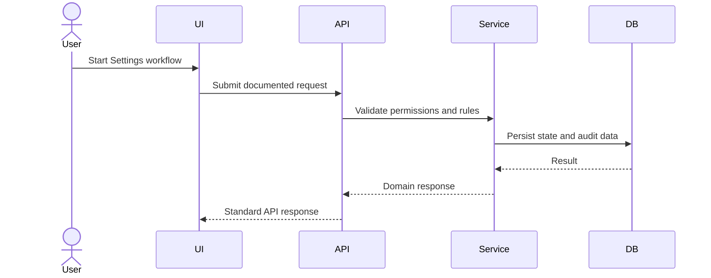

# Settings Sequence Diagram

```mermaid
sequenceDiagram
    actor User
    participant UI
    participant API
    participant Service
    participant DB
    User->>UI: Start Settings workflow
    UI->>API: Submit documented request
    API->>Service: Validate permissions and rules
    Service->>DB: Persist state and audit data
    DB-->>Service: Result
    Service-->>API: Domain response
    API-->>UI: Standard API response
```

