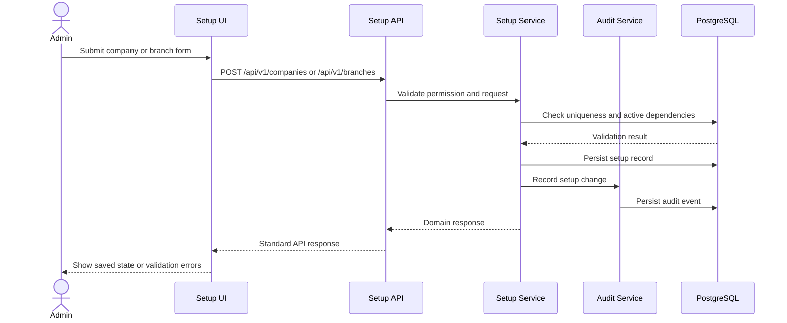

# Setup Sequence Diagram

```mermaid
sequenceDiagram
    actor Admin
    participant UI as Setup UI
    participant API as Setup API
    participant Service as Setup Service
    participant Audit as Audit Service
    participant DB as PostgreSQL

    Admin->>UI: Submit company or branch form
    UI->>API: POST /api/v1/companies or /api/v1/branches
    API->>Service: Validate permission and request
    Service->>DB: Check uniqueness and active dependencies
    DB-->>Service: Validation result
    Service->>DB: Persist setup record
    Service->>Audit: Record setup change
    Audit->>DB: Persist audit event
    Service-->>API: Domain response
    API-->>UI: Standard API response
    UI-->>Admin: Show saved state or validation errors
```
